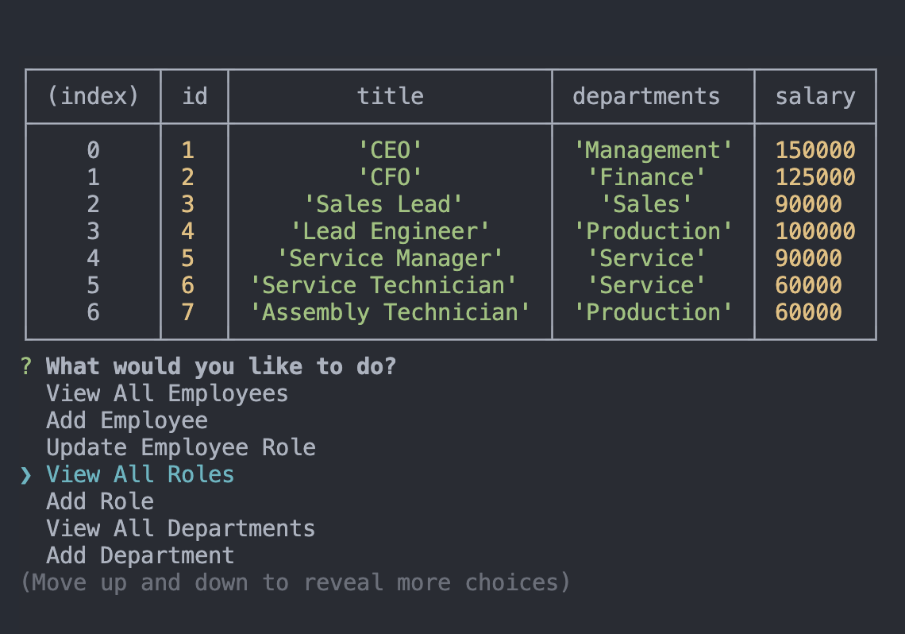

# Employee Tracker

## Description

This project was built to be able to view and manage a database that contains employee information, being able to view different sets of information in a format that is easy to understand. This application allows you to do that through a simple command line interface and quickly gives you the informatin you are looking for.

## Table of Contents

- [Installation](#installation)
- [Usage](#usage)
- [Tests](#tests)
- [Contributing](#contributing)
- [License](#license)
- [Link](#link)
- [Screenshot](#screenshot)
- [Questions](#questions)

## Installation

    npm i

## Usage

Once the repository has been cloned to your local machine, simply run node app.js from the command line while you are in the root directory of the repository.

## Tests

No tests have been written for this application, but feel free to write some and test away!

## Contributing

Please follow the Contributors Covenant.

## License

This project is licensed under the MIT license. (c) 2021

## Link

https://drive.google.com/file/d/1M52irqBS1WPeypVJN67TRBvVEleOa-n6/view

## Screenshot

## Questions

#### If you have questions or would like to contact me for more information, you can find me on Git Hub or send me and email.

- https://github.com/elliscj
- elliscj@colorado.edu
